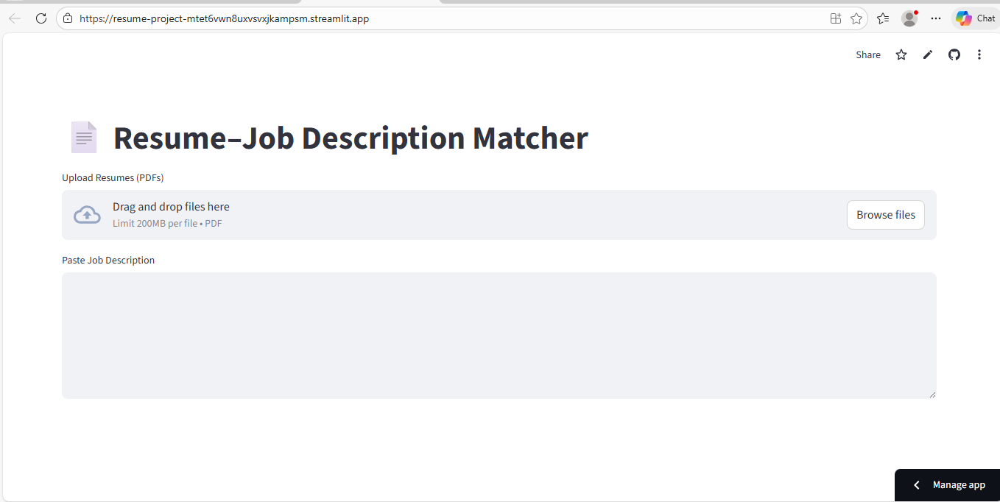
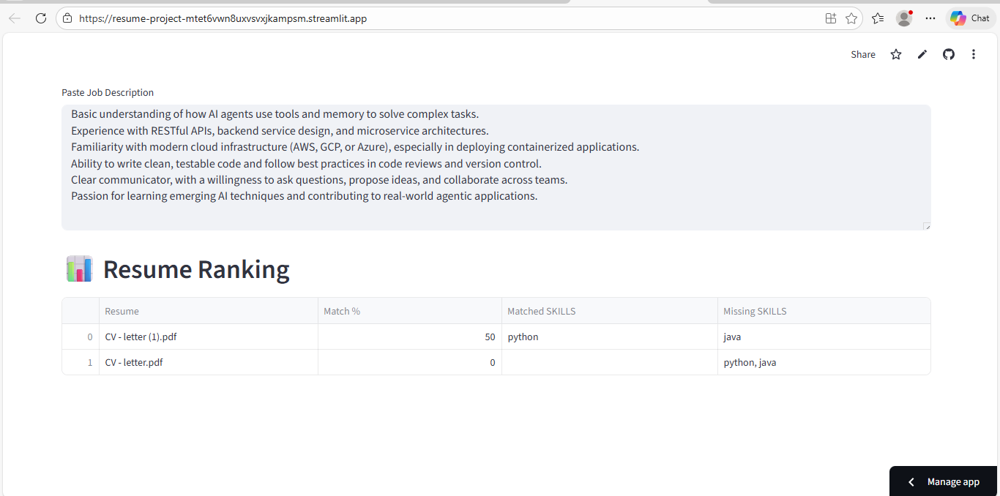
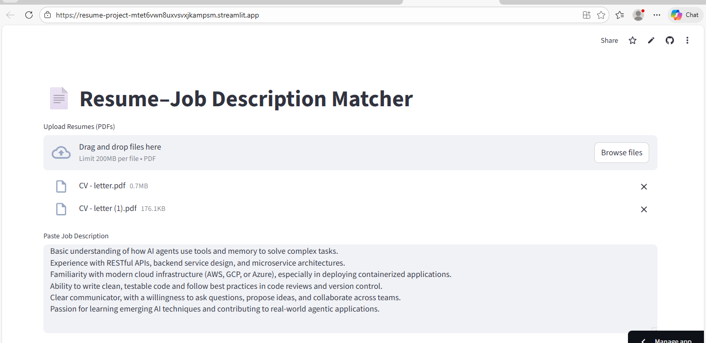

# 🚀 Resume – Job Description Matcher

A full-stack AI-powered web application that compares resumes with job descriptions and provides a **match score, semantic similarity, and skill gap analysis**.

An AI-powered Resume–Job Description Matching System that evaluates candidate resumes using TF-IDF, cosine similarity, and semantic analysis to provide match scores and skill gap insights.
---

## 🔥 Live Demo

* 🌐 Frontend (Streamlit): *(https://localhost:8501/)*
* ⚙️ Backend API: https://resume-project-n5ko.onrender.com

---

## 🧠 Features

* 📄 Upload multiple resumes (PDF)
* 📝 Paste job description
* 📊 Match score using **TF-IDF + Cosine Similarity**
* 🧠 Semantic similarity analysis
* 🛠️ Skill matching & missing skills detection
* 📈 Ranked results (best match first)

---

## 🏗️ Architecture

```
Streamlit (Frontend UI)
        ↓
HTTP Request (POST /match)
        ↓
Flask API (Render Backend)
        ↓
AI Processing (TF-IDF + Semantic Matching)
        ↓
JSON Response (Scores + Skills)
```
## 🌟 Highlights

- Built full-stack AI application (Streamlit + Flask)
- Implemented NLP techniques for resume matching
- Deployed scalable backend using Render
- Designed interactive UI for real-time analysis
---

## 🛠️ Tech Stack

* **Frontend:** Streamlit
* **Backend:** Flask
* **ML/NLP:** Scikit-learn (TF-IDF, Cosine Similarity)
* **PDF Processing:** PyPDF2
* **Deployment:** Render (API), Streamlit Cloud (UI)

---

## 📂 Project Structure

```
resume_jd_matcher/
│
├── app.py                  # Flask backend
├── matcher.py              # TF-IDF + skill matching logic
├── streamlit_app.py        # Streamlit frontend
├── requirements.txt        # Dependencies
├── Procfile                # Render deployment
│
├── semantic/
│   └── semantic_matcher.py # Semantic similarity logic
│
└── README.md
```

---

## ⚙️ Installation (Local Setup)

### 1️⃣ Clone Repository

```
git clone https://github.com/your-username/Resume-Project.git
cd resume_jd_matcher
```

### 2️⃣ Create Virtual Environment

```
python -m venv venv
```

### 3️⃣ Activate Environment

```
# Windows
venv\Scripts\activate

# Mac/Linux
source venv/bin/activate
```

### 4️⃣ Install Dependencies

```
pip install -r requirements.txt
```

---

## ▶️ Run Locally

### Run Backend (Flask)

```
python app.py
```

### Run Frontend (Streamlit)

```
streamlit run streamlit_app.py
```

---

## 🔗 API Endpoint

### POST `/match`

**Input:**

* `jd` → Job description (text)
* `resumes` → PDF files

**Output:**

```json
[
  {
    "name": "resume.pdf",
    "score": 78.5,
    "semantic_score": 85.2,
    "matched_skills": ["python", "flask"],
    "missing_skills": ["docker"]
  }
]
```

---

## 💡 How It Works

1. Extracts text from resume PDFs
2. Cleans and preprocesses text
3. Converts text → TF-IDF vectors
4. Computes similarity using cosine similarity
5. Performs skill comparison
6. Returns ranked results

---

## 🚀 Future Improvements

* 🔍 Use BERT for advanced semantic matching
* 📊 Add visualization dashboard
* 📄 Download PDF report
* 🌐 Multi-language support

---

## 👩‍💻 Author

**Divya Banoth**

---

## ⭐ Acknowledgements

* Scikit-learn
* Streamlit
* Flask

---

## 📌 Note

This project demonstrates **real-world full-stack AI system design**, including frontend-backend separation and deployment.

### 📸 Screenshots



